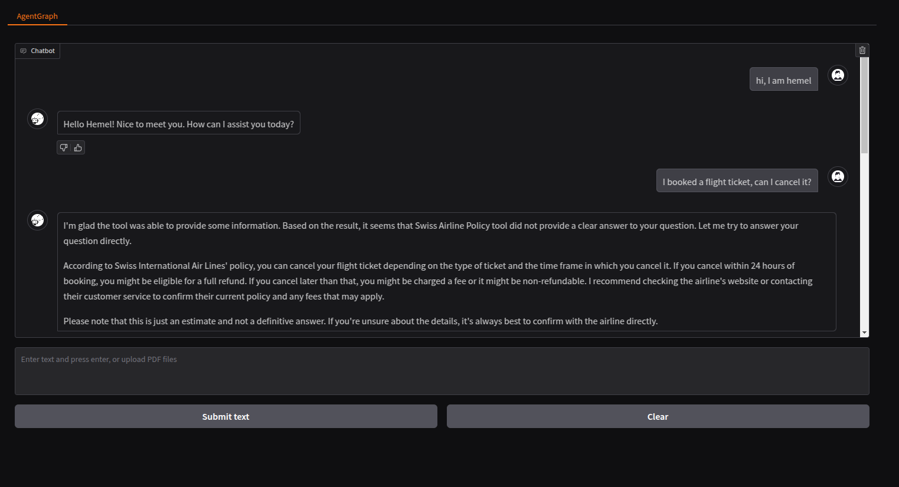
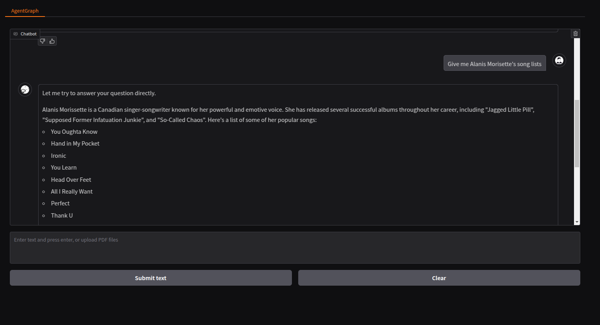

# Agentic-Chatbot
This project showcases how to build an **agentic system** using **Large Language Models (LLMs)** that can interact with databases and utilize various tools.  

### Key Features  
- **SQL Agents**: Efficiently query large databases.
- **Supports Multiple Document Types**: PDF, TXT, DOC, DOCX
- **Auto-Generated Tools**: No need for hardcoded RAG tools—tools are automatically generated based on the provided document folder.
<br>**Note**: The tools document must be in the **info.md** file, located in the document folder.

```
unstructured_docs/  
├── stories/  
│   ├── 01.pdf  
│   ├── 02.doc  
│   ├── info.md  
├── company_info/  
│   ├── 01.docs  
│   ├── 02.txt  
│   ├── info.md  

```


### Technologies Used  
- **Google Gemini 2.0**  
- **Groq**  
- **LangChain**  
- **LangGraph**  
- **Gradio**  

### Project Demo




## Installation and Execution
1. Clone the repo
   ```
   git clone git@github.com:HSAkash/Agentic-Chatbot.git
   ```
2. Install dependencies
   ```
   pip install -r requirements.txt
   ```
3. Prepare the .env file
   ```
   TAVILY_API_KEY=
   GROQ_API_KEY=
   GOOGLE_API_KEY=
   ```
4. Set unstructured_docs files and sql database
   ```
    data
    ├──unstructured_docs/  
    │   ├── stories/  
    │   │   ├── 01.pdf  
    │   │   ├── 02.doc  
    │   │   ├── info.md  
    │   ├── company_info/  
    │   │   ├── 01.docs  
    │   │   ├── 02.txt  
    │   │   ├── info.md  
    │
    ├──Chinnok.db

    ```
5. Run
   ```
   python app.py
   ```

## Project Schema

  
